# 股票初级课

> 初级课：学会建立投资组合
>
> 进阶课：学会通用个股分析技巧。优中选优
>
> 高级课：学会特殊行业的分析方法。

##  股票入门

###   找准入市时机

- 主要的投资流派：
  - 技术投资派 -- 通过分析股票的价格走势，来预测股票未来的涨跌
  - 宏观投资派 -- 逻辑是整个市场经济向好，股市就会向好。
  - 有效市场派 -- 认为市场大部分时候对股票的定位是正确的。（重点研究内幕消息）
  - 成长投资派 -- 关注公司未来是否足够高的增长，重点是找到刚起步，未来会腾飞的公司（`ps`:腾讯）
  - **价值投资派** -- 看重公司当前的内在价值。低买高卖是价值投资的本质。
    - "捡烟蒂" 投资法
      - 烟蒂股：毫不起眼、甚至被抛弃的公司
      - 捡烟蒂需要的成本远低于他们本身的价值
      - 继续下跌的概率小，上涨的概率大于下跌的概率
    - "好公司" 投资法
      - 投资核心：找到好公司，在价格较低的时候买入
      - 好公司的价值最终一定显现在股价上

- **天时**

  - 一家公司的价值 = 现在公司的价值 + 未来公司能赚取的价值

  - **市盈率(PE)** = 市值 / 净利润 = 买下公司需要的钱 / 每年能赚到的钱

    - PE越小 -> 回本年限越短 -> 越有投资价值

    > 简单理解：**买下公司多久能回本**

  - **市净率(PB)** = 市值 / 净资产 = 买下公司需要的钱 / 属于公司自己的资产

    - PB越小 -> 价格越低 -> 越有投资价值

    > 简单理解：**公司自有资产的占比**

  - 入市时机

  ```
  当沪深300、中证500中任意一个的PE和PB同时满足：
  1. PE处于近10年数值的0-50%区间内
  2. PB处于近10年数值的0-20%区间内
  则认为沪深300或中证500处于低估状态，此时可以入场投资
  
  入场投资的3中情况：
  1.沪深300的PE和PB同时满足条件。但中证500没有
  2.中证500的PE和PB同时满足条件。但沪深300没有
  3.沪深300，中证500的PE 和 PB同时满足
  ```

  - **查询PE或PB的方法**

  ```
  1. 百度 理杏仁。
  2. 搜索 沪深300， 选择后面带（指数）的那个
  3. 点击PE-TTM，加权平均值，十年。即可看到沪深300的PE图。
     - PE-TTM： 就是PE，TTM是一种更为精确的计算PE的方式
     - 加权平均值：表示把沪深300包含的公司市值相加除以300家公司的净利润之和，相当于把300家公司'合成'一家。来计算它的PE。
     - 10年。使用10年的数据能够较客观的判断当前估值相对于过去10年是高还是底。
     
  *** 通过判断当前分位点，判断是否适合入场。
  PE < 50%
  PB < 20%
  ```

###   合理规避风险

- **地利**

  - 系统性风险（整个股票市场存在的下跌风险）
    - 政策风险 -- 政策改变导致企业生存条件变化
    - 购买力风险 -- 通货膨胀风险
    - 利率风险 -- 市场利率会不断波动
  - 非系统性风险（个股本身的风险）
    - 经营风险 -- 公司经营的错误决策很可能导致公司业绩大幅下滑
    - 使用风险 -- 公司违背信用所产生的风险。
    - 道德风险 -- 违背道德事件，例如三鹿"毒奶粉事件"

  - **规避非系统性风险**
    - 把资金分散在多个多个行业的多只股票上（鸡蛋不要放在同一个篮子）
    - 对于一般人，持有**4~8**只股票是合理的选择，既不会需要大量的时间和资金进行管理，且可以规避大部分系统性风险。
    - 同一行业的股票在配置占比中，*不应*超过重资金量的**30%**。

##  白马组合

### "好公司"投资法：初筛白马股

- 投资回报率高，长期业绩优秀，信息相对可靠

#### 投资回报率

> 投资多少能赚多少的比例。

> 一只股票的投资回报率又叫**投资收益率**
>
> 一只股票的投资回报率（投资的钱所赚钱的比率） = （卖出价格 / 买入价格 - 1）* 100%

```
// 在2016年1月27日。18元买入格力电器
// 在2018年1月26日，57元的价格卖出
投资收益率就是（57 / 18 - 1） * 100 = 217%

// 如果计算到每年的话，就是
年化复合收益率 = [(卖出价格/买入价格)^(1/n)-1] * 100%
其中n=投资年限
格力电器投资2年的年化复合收益率=[(57 / 18) ^ (1 / 2) - 1] * 100% = 78%。 
```


- 净资产收益率（ROE） = 净利润 / 净资产

  - 代表企业用一元钱的净资产能够赚多少净利润，也就是带来多少投资回报，代表企业的赚钱能。

  - 用芒格的话，如果长期持有一只股票，那么你的年化符合率和企业的净资产收益率，没有任何区别

  - 由下表可知： **ROE越高，股票的年化收益率就越高**

    | 公司               | 贵州茅台 | 格力电器 | 云南白药 | 信隆健康 |
    | ------------------ | -------- | -------- | -------- | -------- |
    | 十年复合年化收益率 | 32.91%   | 27.04%   | 20.46%   | 8.80%    |
    | 十年平均ROE        | 34.38%   | 33.19%   | 23.41%   | 3.78%    |

#### **初筛选方法**

- [i问财](https://www.iwencai.com)
- 筛选条件： 连续7年ROE大于等于15%，上市时间大于5年。
- 财务披露时间

| 季度   | 公布时间       | 统计区间                                                  |
| ------ | -------------- | --------------------------------------------------------- |
| 一季度 | 4/1 ~ 4/30     | 1/1 ~ 3/31 共**3**个月                                    |
| 二季度 | 7/1 ~ 8/30     | 1/1 ~ 6/30 共**6**个月                                    |
| 三季度 | 10/1 ~ 10/30   | 1/1 ~ 9/30 共**9**个月                                    |
| 年报   | 次年1/1 ~ 4/30 | 1/1 ~ 12/31 共**全年**<br/>必须在次年一季度财报披露前披露 |

------

### "好公司"投资法：剔除周期股

> 公司收益跟经济周期**强相关**的公司股票即为周期股
>
> 所有行业都会被经济周期影响，但并非所有行业都会被强烈影响
>
> 因为一个经济周期的时间跨度很可能**>7年**，所以假如只用ROE连续7年>=15%的指标筛选，筛选出来的结果会包含周期股；或者公司上市时间短历史数据不足造成误判所致

#### 周期性行业

- 四类要避开的行业
  - 作为工业基础原材料的大宗商品相关行业
    - 采掘服务、钢铁、化工合成材料、化工新材料、石油矿业开采、有色冶炼加工、化学制品等；
  - 航运业
    - 远洋运输、港口航运、机场航运、交运设备服务等；
  - 非生活必需品行业，及与之相关的行业
    - 国防军工、汽车整车、汽车零部件、建筑材料、房地产等；
  - 非银行的金融行业
    - 证券、保险及其他

#### **二筛选方法**

- 连续7年ROE大于等于15%，上市时间大于5年。行业
- 导出条件如下图
  - 

- 用excel打开，最后根据行业剔除4大类即可。

------

### "好公司"投资法：剔除基本面转坏的股票

- 判断一家公司业绩是否下滑（评估白马股是否业绩下滑）

  - 最近的年度营收增长率

    =（本年的营业收入 - 去年的营业收入）/ 去年的营业收入

    - 最近的年度净利润增长率

    =（本年的净利润 - 去年的净利润）/ 去年的净利润 

  - 最近的季度营收增长率

     =（本季度的营业收入 - 去年同季度的营业收入）/ 去年同季度的营业收入

  - 最近的季度净利润增长率

    = （本季度的净利润 - 去年同季度的净利润）/ 去年同季度的净利润 

> **如上有一个是负数，就需要剔除**

- 诺基亚的案例

| 年份         | 2007   | 2008    |
| ------------ | ------ | ------- |
| ROE          | 48.77% | 28.07%  |
| 营收增长率   | 24.17% | -0.68%  |
| 净利润增长率 | 67.32% | -44.65% |


#### **三筛选方法**

- 连续7年ROE大于等于15%，上市时间大于5年，行业，2019年12月31日营收增长率，2019年12月31日净利润增长率，2018年营收增长率，2018年净利润增长率。

### 学会查看财务三表

> 白马股的特点： 投资回报率高，长期业绩优秀，信息相对可靠，通过前面的筛选，已经可以确定白马股的前两点。最后还需要通过财务三表分析。才能最终确定**"信息相对可靠"**

- 财报 -- 从会计角度纪录公司所有经营事务的报表
  - **利润表**
    
    - 又叫损益表，主要体现公司一段时间内是赚钱还是亏钱
    - 收入的多少直接影响公司利润的多少。
    - `营业收入 - 营业成本 - 三费 = 营业利润`
    - `营业利润 - 所得税 = 净利润`
      - 营业收入，卖东西的收入
      - 营业成本，购买生产货物的原材料等所付出的钱
      - 三费，包括管理费用、销售费用、财务费用
  - **资产负债表**
    
    - 记录特定的一天，公司有多少钱、财、物以及欠别人多少钱。
    - 资产 = 负债 + 所有者权益（aka: 公司实际的净资产）
    - 
  - **现金流量表**（aka：财务状况变动表）
    
    - 开支流水账，记录了公司花出去多少钱，收回多少钱
    
    - 现金流量表 与 资产负债表 与 利润表 三者关系密切
    
      - 经营活动现金流量
        - 来自利润表
      - 投资活动产生的现金流量
        - 来自资产负债表，资产部分
      - 筹资活动现金流量
        - 来自资产负债表，负债部分
    
      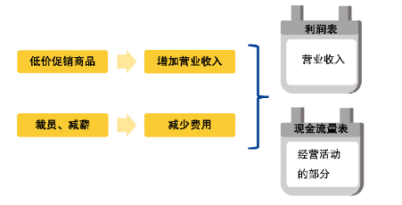
    
      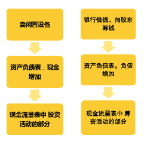

#### 财务三表分析（1）如何识别收入美化

> 公司的营业收入 -- 一旦给到了货，无论是否收到钱，都可以确认为收入

> 因此公司可能为了让公司的营业收入增加，让业绩增长以稳定股价。会让朋友假装买，出财报后再退货

> 识别收入美化的方法：**综合分析财务报表中，营业收入和应收账款的变化**
>
> **应收账款**：企业卖产品给客户，但还未收的钱，也就是客户签的白条
>
> **营业收入**：企业卖产品获得的收入。即使没有收到现金，收到的"白条"也是

##### **★小熊定理一：连续两年应收账款上升幅度大于营业收入上升幅度，则需要警惕**

- 1. [理杏仁](<https://www.lixinger.com/profile/center/home/all>) 搜索 "人民同泰"

  2. 找到营业收入数据，计算每年的增长金额。营业收入在利润表中，点击页面的"利润表"

  3. 假设现在时间是2018年6月份，将起始时间设置为2014年，结束时间为2018年。看年度数据就可以。

     

  4. 将数据复制到`excel`表中，删除同比增长比例，只保留数据。

     

  5. 使用减法公式，计算每年营业收入的增长金额

     

  6. 找到应收账款，计算增长金额，应收账款在资产负债表中，点击"资产负债表"

     

  7. 页面下拉，找到应收账款，复制到`excel`表格中。

  8. 用同样的方法。计算"应收账款"的增长金额。

     

  9. 比较每一年营业收入和应收账款各自增长的幅度，可以用当年的应收账款增长金额 - 营业收入增长金额

     1. 如果 > 0,说明应收账款涨幅更大；如果 < 0，说明应收营业收入更大 。
     2. 如果连续2年 > 0，就说明这个公司连续2年应收账款上升幅度大于营业收入上升幅度，我们就要当心了。如果连续2年增长金额一年大于0，一年小于0，或者连续2年小于0，都无需担心。

  10. `！!因为银行业务的特殊性，并没有应收账款等科目，银行股不适用小熊定理一`

#### 财务三表分析（2）如何识别资产美化

> 问题主要在存货上。
>
> 存货不仅指生产出的货物，还包括生产用的原材料、生产过程中的半成品
>
> "存货"包含的项目比较多，从财报中只能看到资金总额，这就给了别有用心的公司一个机会

##### **★小熊定理二： 连续2年存货增长大于营业收入的增长，这家公司的存货可能有问题**

- 1. [理杏仁](<https://www.lixinger.com/profile/center/home/all>) 搜索 "獐子岛"，验证2011年到2014年，獐子岛的存货与营业收入增长情况

     

     

  2. 在资产负债表中找到2011年-2014年的存货数据，计算存货的增长情况。

     

     

  3. 验证小熊定理二。比较每一年营业收入和存货增长金额的差异，用当年的存货增长金额减去营业收入增长金额。

     1. 如果结果`>0`，说明存货涨幅更大；如果结果`<0`，则说明营业收入涨幅更大。
     2. 如果出现连续2年结果都`>0`，就说明这个公司连续2年存货增长金额大于营业收入增长金额，就要当心了。

     

------

##### **★小熊定理三：如果一家公司的流动负债远大于流动资产的话，就说明这家公司已经非常接近破产了。**

- 流动资产：一年内可以变现的资产，如货币资金、存钱、预付款项；

- 流动负债：一年内必须要还的签，如应付账款、短期借款等；

- 流动比率：流动资产 / 流动负债

- 如果企业的流动比 `<1`，说明流动资产小于流动负债，危险的信号！！

- 1. [理杏仁](<https://www.lixinger.com/profile/center/home/all>) 搜索 "海信家电(原海信科龙)"，点击"资产负债表"，找到"流动比率"这个指标
  2. 一般看最近3年的数据就可以了，如果有2年都小于1，就要当心了

  

- 总结，除了银行股外，所选的公司只要有一个定理不能通过检验，就要剔除。

------

#### 财务三表分析（3）自由现金流的重要性

##### ★小熊定理四：当一家公司经营活动产生的现金流量净额远大于净利润，说明这家公司可能有隐藏的盈利能力

- 1. [理杏仁](<https://www.lixinger.com/profile/center/home/all>) 搜索 "伊利股份"

  2. 在"现金流量表"中，找到近3三年"经营活动产生的现金流量净额"的数据

     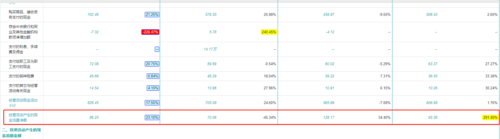

  3. 从"利润表"中找出近三年的"净利润"数据，计算差额

  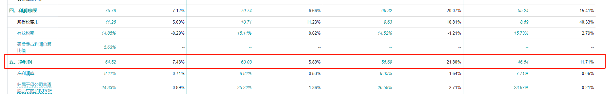

  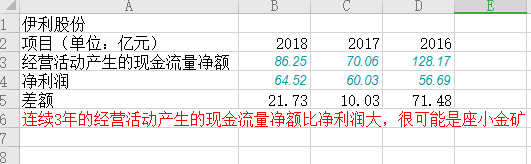

------

##### ★小熊定理五：自由现金流代表公司真正能自由运用的资金，比净利润更真实，更难作假

- 自由现金流 = `经营活动产生的现金流量净额 - 资本开支`

- 经营活动产生的现金流量净额 = `所有经营活动收到的现金 - 所有经营活动支付的现金`

- 资本开支是现金流量表的"购买固定资产、无形资产和其他长期资产支付的现金"

- 1. [理杏仁](<https://www.lixinger.com/profile/center/home/all>) 搜索 "伊利股份"
  2. 从"财务指标"模块中找到"现金流量"中的"自由现金流量"

  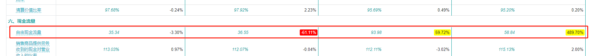

- 我们在构建白马股组合时，一般不用小熊定理四和五，因为小熊定理四和五时深入分析公司的内容了。

### 实操：构建白马组合

- 判断入场时机，以2020年2月14日为例。

- [理杏仁](<https://www.lixinger.com/profile/center/home/all>)，搜索沪深300，中证500，将分位点填入表中。

  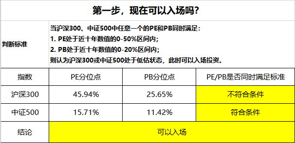

- [i问财](<http://www.iwencai.com/>)搜索：`连续7年ROE大于等于15%，上市时间大于5年，行业，2019年9月30日营收增长率，2019年9月30日净利润增长率，2018年营收增长率，2018年净利润增长率。`,筛选条件如下图，然后导出即可

  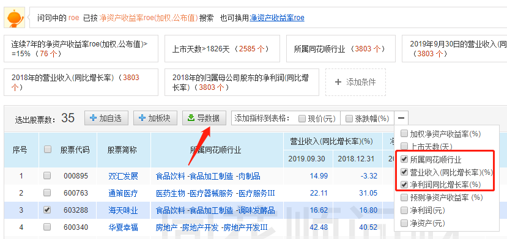

- 将导出数据复制粘贴到'地利（白马组合中）'

  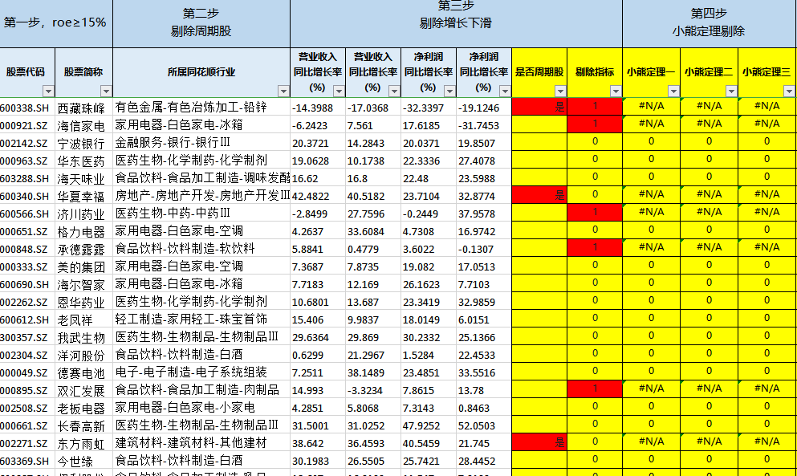

- 通过筛选，去掉周期股，剔除指标。

  

- 将剩下的公司复制到`小熊定理判断`。然后按顺序，在理杏仁搜索第一家公司，点击"`自定义财报`"，选择`数据显示设置`，填写或选择"`营业收入、应收账款、存货、流动比率`"

  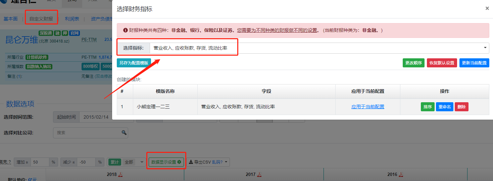

- 可以一次选择对比6家公司，（从表格中按顺序从上往下对比即可，`银行股不需要对比，默认通过小熊判断`）,然后，把信息复制进表格即可。

  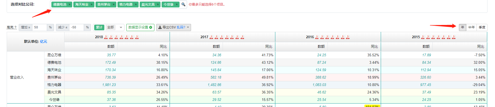

- 

  - `如果出现不是 0 或者 No，就说明表格中有数据是错误的。比如为空时，我们手动填写为0，如果金额是万为单位，也要我们手动删除 '万'，并且小数点往前4位。因为其他的单位是亿`

- 然后回到`地利（白马组合）表格`中，把小熊定理为`No`的去掉即可。

- 最后，快速找出白马股的分位点。`理杏仁 -> 选股 -> 基本面选股 -> A股市场`

  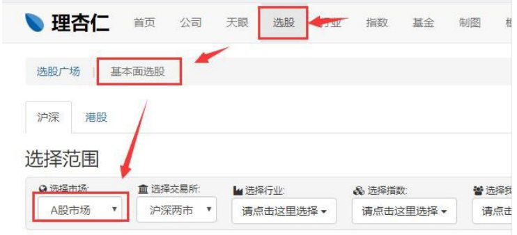

- 在基本指标下列单击 `PE-TTM（扣非）分位点（10 年）`->`PB（不含商誉）分位点（10 年）`,然后后导出表格。并把数据复制到"`指定日期分位点`"

  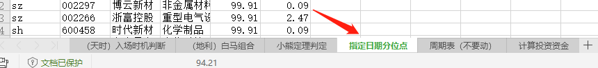

- 回到白马组合，把分位点50%以上的PE和PB都去掉，就能得出最终的白马结果


- 最后总结：
  - `1. 同行业股票数量和总资金都不能超过 30%的占比；`
  - `2.选择顺序，从上到下，尽量选择靠前的公司，也可以按自己的风险承受能力来灵活调整 如果挑选 8 只股票构建组合，可以从上到下挑选前 8 只`
  - `3. 如果不足4只。可以考虑便宜组合`

##  便宜组合

##  轻松实践

